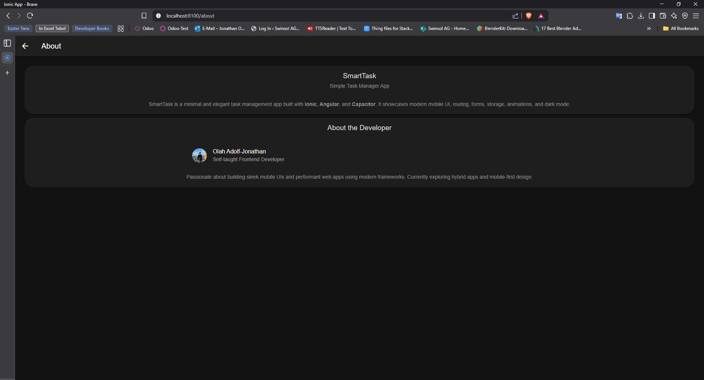
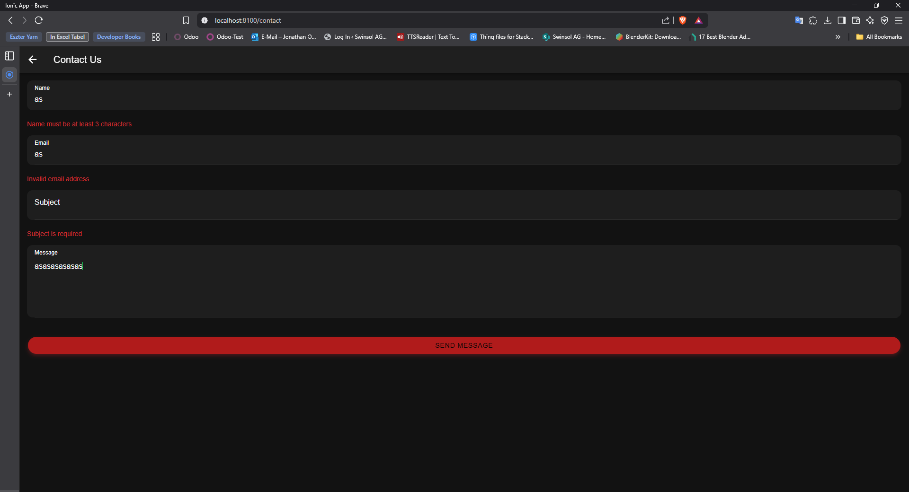
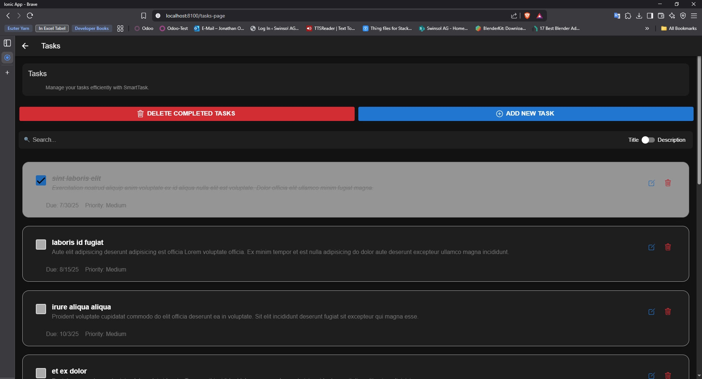

# SmartTask

<div align="center">
  
  <h1>🚀 SmartTask</h1>
  <p><em>Your elegant, minimal task management companion</em></p>
  
  
  
  
  

</div>

---

## ✨ What Makes SmartTask Special?

SmartTask isn't just another to-do app – it's a **modern, responsive task management experience** built with cutting-edge web technologies. Perfect for developers who want to see **Ionic + Angular** in action!

### 🎯 Key Features

| Feature | Description |
|---------|-------------|
| 🌙 **Smart Dark Mode** | Automatic theme switching with system preference |
| 📱 **Mobile-First Design** | Optimized for touch interactions and mobile UX |
| ⚡ **Lightning Fast** | Built with Angular signals for optimal performance |
| 🎨 **Smooth Animations** | Delightful micro-interactions and transitions |
| 📄 **Smart Pagination** | Handle large task lists with ease |
| 🔍 **Advanced Search** | Toggle between title and description search |
| 💾 **Persistent Storage** | Your tasks are saved locally |

## 📱 Screenshots

<div align="center">
  
  | Main Page | About Page |
  |------------|-----------|
  |  |  |

  | Contact Page | Tasks Page |
  |------------|-----------|
  |  |  |
  
</div>

## 🚀 Quick Start

### Prerequisites

Make sure you have these installed:
- ✅ [Node.js](https://nodejs.org/) (v16+ recommended)
- ✅ [Ionic CLI](https://ionicframework.com/docs/cli): `npm install -g @ionic/cli`

### Installation

```bash
# Clone the repository
git clone https://github.com/johnnyadolf/ionic_first.git

# Navigate to project
cd ionic_first

# Install dependencies
npm install

# Start development server
ionic serve
```

### 📱 Build for Mobile

```bash
# Build the app
ionic build

# Add platform (choose one)
ionic capacitor add android
ionic capacitor add ios

# Sync and open
ionic capacitor sync
ionic capacitor open android  # or ios
```

## 🏗️ Project Architecture

```
src/
├── app/
│   ├── pages/           # Feature pages
│   │   ├── home/        # Landing page with navigation
│   │   ├── tasks-page/  # Main task management
│   │   ├── about/       # App information
│   │   └── contact/     # Contact form
│   ├── services/        # Business logic & API calls
│   ├── model/           # TypeScript interfaces
│   └── shared/          # Reusable components
├── assets/              # Images, icons, fonts
└── global.scss          # Global styles & theme variables
```

## 🛠️ Tech Stack

<div align="center">

| Frontend | Mobile | Development |
|----------|--------|-------------|
| Angular 17+ | Capacitor | TypeScript |
| Ionic 7+ | Native APIs | RxJS |
| SCSS | PWA Ready | Angular CLI |

</div>

## 🎨 Features Deep Dive

### 🌙 Dark Mode Implementation
- System preference detection
- Smooth theme transitions
- Persistent user choice

### 📱 Mobile-First UX
- Touch-optimized interactions
- Native-like animations
- Responsive design patterns

### 🔍 Smart Search System
- Toggle between title/description search
- Real-time filtering
- Debounced input for performance

### Development Guidelines
- Follow Angular style guide
- Write meaningful commit messages
- Test on both mobile and desktop
- Update documentation when needed